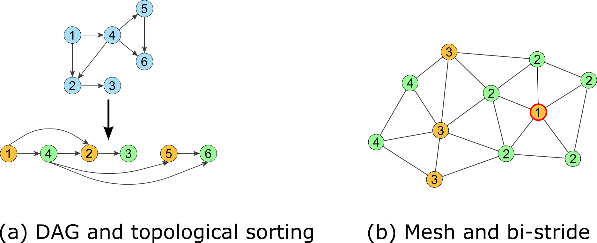

# Bi-stride Multi-Scale GNN

This repository contains the code implementations for [Efficient Learning of Mesh-Based Physical Simulation with BSMS-GNN (ICML 2023)](https://openreview.net/forum?id=2Mbo7IEtZW). The paper is also available on [Arxiv](https://arxiv.org/abs/2210.02573).

## Motivations
<div  style="display:flex; flex-direction:row;">
    <figure>
        
    </figure>
</div>

We focus on developing a multi-scale graph neural network for physics-based simulation. Previous works have certain limitations when it comes to building multi-scale connectivity.

- GraphUNet (Gao et al., 2019) has additional scoring modules to select the most informative nodes for constructing coarser levels. They adopt a power-of-2 adjacency enhancement to prevent loss of connectivity. However, this enhancement does not guarantee connectivity preservation.
- MS-GNN-Grid (Lino et al., 2021) uses background helper grids to build the coarser levels. However, this approach can blur boundaries that are spatially close but not necessarily geodesically close.
- MultiScale MeshGraphNets (Fortunato et al., 2022) uses manually drawn coarser meshes for the same domain, but this requires a significant amount of additional labor.

We aimed to find a solution that would be consistent across any input graphs, without introducing blurring effects on cross-boundary edges, while preserving correct connectivity and minimizing additional labor.

## Method

### Bi-stride pooling

<div  style="display:flex; flex-direction:row;">
    <figure>
        
    </figure>
</div>

We drew inspiration from bipartite graphs, where nodes can be split into two groups, and the minimum geometric distance between the two groups is exactly one hop away. This property allows a simple power-of-2 adjacency enhancement to preserve connectivity. We extend this idea to a general mesh:

1. Select an initial node.
2. Perform Breadth-First-Search on a general mesh, marking the geodesic distance to the initial node.
3. Pool nodes at every other level and apply the power-of-2 adjacency enhancement.

This process ensures that the connectivity is preserved at any depth of coarser level.

### Pipeline

<div  style="display:flex; flex-direction:row;">
    <figure>
        
    </figure>
</div>

1. Before training, we employ bi-stride pooling as a pre-processing step to determine the multi-level graph for the input mesh.
2. Based on the multi-scale connectivities, we then determine non-parametric transition modules.
3. These advantages eliminate the need for additional overhead such as scoring modules or matrix enhancement during training.

## Results
Our dataset includes the following: 1) cylinder flow, 2) compressible flow around an airfoil, 3) elastic plate, and 4) inflating elastic surface. The multi-scale structure of these datasets, achieved through bi-stride pooling, is shown below:
<div  style="display:flex; flex-direction:row;">
    <div>
    <figure>
        
    </figure>
    </div>
</div>

The method performs well on all datasets, demonstrating significant improvements in training and inference time as well as RAM consumption.
<div  style="display:flex; flex-direction:row;">
    <div>
    <figure>
        
    </figure>
    </div>
</div>

The absence of cross-boundary edges helps avoid artificial blurring effects.
<div  style="display:flex; flex-direction:row;">
    <div style>
    <figure>
        
    </figure>
    </div>
</div>

Bi-stride pooling consistently works on unseen geometry, leading to higher accuracy.
<div  style="display:flex; flex-direction:row;">
    <div style>
    <figure>
        
    </figure>
    </div>
</div>

Overall, we achieve the lowest inference error compared to previous methods in the most contact-rich test case.
<div  style="display:flex; flex-direction:row;">
    <div style>
    <figure>
        
    </figure>
    </div>
</div>

## Requirements

- Pytorch
- PyG
- Numpy
- h5py
- TensorBoard
- SciPy
- scikit-learn
- sparse-dot-mkl

## Download datasets and pretrained models

We host the datasets and pretrained models on this [link](https://drive.google.com/drive/folders/15UjqYdDX_Zhf-uPIs0bIZ5hYVjNiZUZy?usp=share_link). Please maintain the file structure shown below to run the script by default.

```sh
this project
│   ...    
│
└───data
│   └───cylinder
|       └───outputs_test
|       └───outputs_train
|       └───outputs_valid
│       │   meta.json
│   └───...
└───res
│   └───cylinder
|       └───ours
|       |   └───ckpts
|       |       |   *.pt
│   └───...
```

If you store the data and result folders somewhere else, you can modify the `data_dir` and `dump_dir` in the config files accordingly.

## How to use

```sh
# ./run_BSMS.sh $case_name ./configs/$case_name $mode $restart_epoch

# case_name: [cylinder, airfoil, plate, font]
# ./configs/$case_name: stores the corresponding config files of a case
# mode: [0:train, 1:local test, 2: global rollout]
# restart_epoch: -1 (or leave blank) to train from the start; 0, 1... to reload the stored ckpts of a certain frame

# e.g. train font from scratch
./run_BSMS.sh font ./configs/font 0 -1
# e.g. local test RMSE of cylinder at epoch 19
./run_BSMS.sh cylinder ./configs/cylinder 1 19
# e.g. global rollout RMSE of airfoil at epoch 39
./run_BSMS.sh airfoil ./configs/airfoil 2 39
```

## Citation

If you find this method useful, please cite it using the following format:

```latex
@inproceedings{cao2023efficient,
  title     = {Efficient Learning of Mesh-Based Physical Simulation with Bi-Stride Multi-Scale Graph Neural Network},
  author    = {Cao, Yadi and Chai, Menglei and Li, Minchen and Jiang, Chenfanfu},
  booktitle = {International Conference on Machine Learning},
  year      = {2023},
  url       = {https://openreview.net/forum?id=2Mbo7IEtZW}
}
```

## ICML Poster


